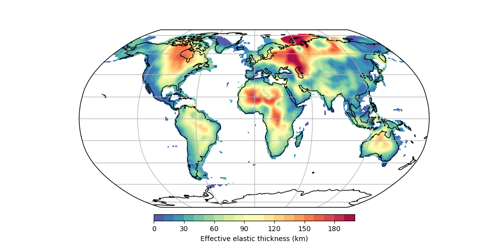
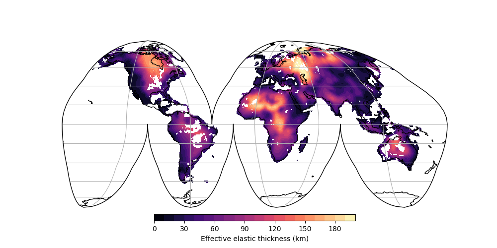

# GlobalTe

Simple tools to extract and plot a global model of effective elastic thickness (<i>T<sub>e</sub></i>) 
of the lithosphere. This (<i>T<sub>e</sub></i>) model was obtained from the inversion of the wavelet
coherence between the topography and Bouguer gravity anomalies. See [Audet and Burgmann (2011)](#reference) 
for details.

See also the software [`PlateFlex`](https://paudetseis.github.io/PlateFlex/), which describes how to 
produce regional grids of (<i>T<sub>e</sub></i>) using the wavelet transform.

## Installation

### Dependencies

The current version was developed using **Python3.7**
Also, the following packages are required:

- [`numpy`](https://numpy.org)
- [`matplotlib`](https://matplotlib.org)
- [`cartopy`](https://scitools.org.uk/cartopy/docs/latest/#)

### Conda environment

We recommend creating a custom 
[conda environment](https://conda.io/docs/user-guide/tasks/manage-environments.html)
where `GlobalTe` can be installed along with its dependencies. 

- Create a environment called `te` and install all dependencies:

```bash
conda create -n te python=3.7 numpy matplotlib cartopy -c conda-forge
```

- Activate the environment:

```bash
conda activate te
```

- Clone the `GlobalTe` repository and install using `pip`:

```bash
git clone https://github.com/paudetseis/GlobalTe.git
cd GlobalTe
pip install .
```

## Usage

Once installed, you can produce a (<i>T<sub>e</sub></i>) map with three lines in `Python`:

```python
from globalte import TeModel as TM
model = TM()
model.plot_global()
```



You can also specify to load a data set that does not include data points biased by
'gravitational noise'. You can also check out a different global projection and a different
colormap:

```python
model_nobias = TM(nobias=True)
model.plot_global(proj='IGH', cmap='magma')
```



The corresponding (<i>T<sub>e</sub></i>) grids are available as attributes of the `model` object:

```python
model.te_global
```

***
**NOTE**

Most data points are `NaN` since (<i>T<sub>e</sub></i>) is only calculated over 'dry' areas (including
shallow shelf areas).

***


## Reference
* [Audet, P. and Burgmann, R. Dominant role of tectonic inheritance in supercontinent cycles, *Nat. Geosci.*, 4, 184-187, 2011](https://www.nature.com/articles/ngeo1080?cacheBust=1508215971286)

